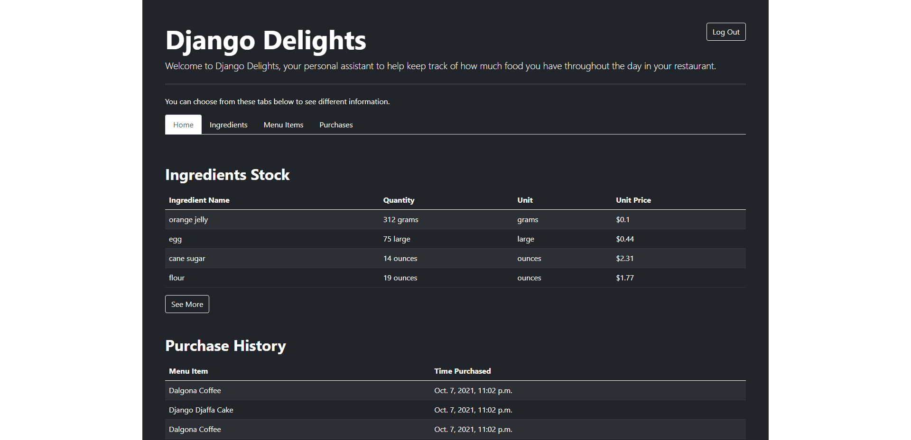

# Django Delight - Restaurant Inventory System with Django

## Table of contents

- [Overview](#overview)
  - [The challenge](#the-challenge)
  - [Screenshot](#screenshot)
  - [Links](#links)
- [My process](#my-process)
  - [Built with](#built-with)
  - [What I learned](#what-i-learned)
  - [Continued development](#continued-development)
  - [Useful resources](#useful-resources)
- [Author](#author)

## Overview

### The challenge

Users should be able to:

- Build an inventory and sales application using Django.
- Users can log in, log out, and must be logged in to use the application.
- Users can add ingredients to the restaurant’s inventory and update their quantities.
- Users should be able to enter in new menu along with their recipe requirements.
- Users can add the different recipe requirements for each menu item
Users can record purchases of menu items (only the ones that are able to be created with what’s in the inventory!)
- Users can view the current inventory, menu items, their ingredients, and a log of all purchases made.
- Users should be able to enter in a customer purchase of a menu item. When a customer purchases an item off the menu, the inventory should be modified to accommodate what happened, as well as recording the time that the purchase was made.

### Screenshot

### Links

- Solution URL: [https://github.com/RandyBrilliant/django-delight](https://github.com/RandyBrilliant/django-delight)

## My process

### Built with

- HTML
- CSS
- JavaScript
- Python
- Django
- Django Crispy Forms
- Bootstrap 5

### What I learned

At this project, since the main focus is to build a working inventory system, I am using Django to handle all of the backend and Bootstrap for giving fresh design to the website. I also utilize the class-based generic views in rendering all of the views. For the form, I am using form-crispy to help me in rendering the form to the HTML.

One thing that I might have accomplished and feel proud of it is the menu creation form, where I can dynamically add the dropdown list for new recipe as well as remove them which I think it's quite cool.

### Continued development

There are a lot room of improvement as wise man once said, after you have completed the project, you will witness many bugs and weakness throughout the day :). I am still exploring deep into the Django Documentation for more reference which I can implemented to the project. Any feedback and suggestion is welcomed. You can reach me out at my social media stated below.

### Useful resources

- [Django Tutorials by Corey Schafer](https://www.youtube.com/playlist?list=PL-osiE80TeTtoQCKZ03TU5fNfx2UY6U4p) - This is actually my first time finishing all of the series in learning web development as the man himself are so clear in explaining all of the details regarding Django.

## Author

- Linkedin - [Randy Brilliant](https://www.linkedin.com/in/randybrilliant22/)
- Instagram - [@randybrilliant](https://www.twitter.com/randybrilliant)
